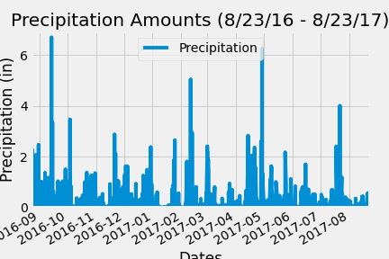
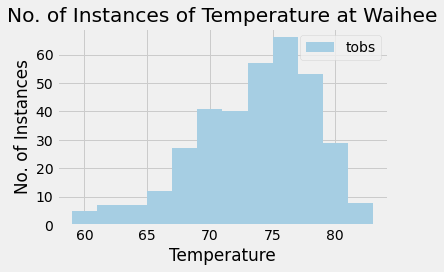
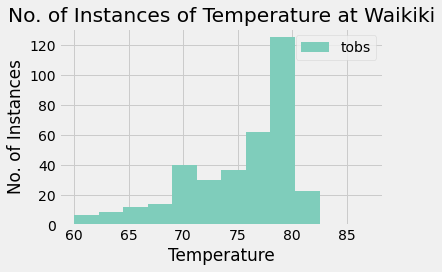

# Surf's Up - SQLAlchemy Challenge <!-- omit in toc -->

## Table of Contents <!-- omit in toc -->

- [Background](#background)
- [Climate Analysis and Exploration](#climate-analysis-and-exploration)
- [Climate App](#climate-app)
- [Bonus: Other Recommended Analysis](#bonus-other-recommended-analysis)
  - [Temperature Analysis I](#temperature-analysis-i)

## Background

In this challenge, I am analyzing climate data for Hawaii.
There were two major components, the _Climate Analysis and Exploration_ and the _Climate App_

## Climate Analysis and Exploration

The code for the Climate and Analysis and Exploration can be seen in the file climate.ipynb
Here, I did multiple analyses.

First the results of the precipitation analysis.  This was looking at the precipitation of all statation in the last year of data - 08/23/16 to 08/23/17. Here is a plot of the results

Second are the results of the station analysis.

If we are looking at the station with the most observations **in the dataset**, the results are for Waihee, which is here

If we are looking at the station with the most observations **in the dataset _in the last year_**, the results are for Waikiki, which are found here

## Climate App

Code for the climate app can be found under app.py.  Enter "python app.py" into a terminal.  You then will go to [http://127.0.0.5000/](http://127.00.5000/) to start the results.

## Bonus: Other Recommended Analysis

There were optional challenge queries.  I shall now attempt these.

### Temperature Analysis I

Hawaii is reputed to enjoy mild weather all year.  is there a meaningful difference between the temperature in June and December?

 - I will bring in hawaii measurements.csv using pandas's `read_csv()` to perform this portion.

 - I will identify the average temperature in June at all stations across all available years.  And I will do the same thing for December.

 - I will use the t-test to determine wheher the difference in the means, if any, is statistically significant.